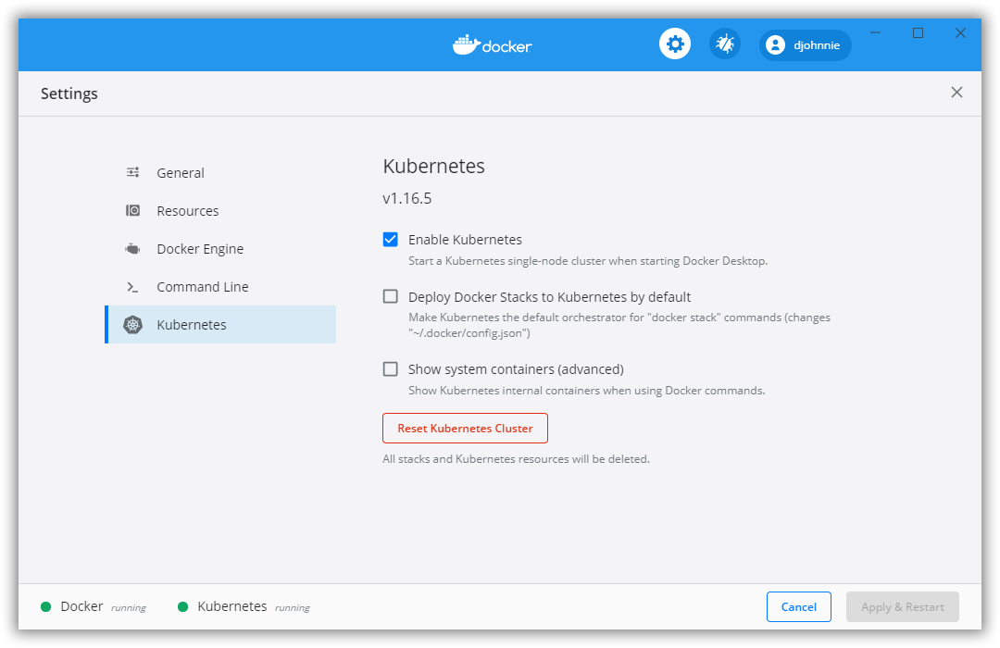

# InvolvedCafe-AzureKubernetesService

Involved Café 2020-07 workshop on Azure Kubernetes Service (AKS)

## Prerequisites

Please prepare your system and install the following software:

- [.NET Core SDK 3.1.302](https://dotnet.microsoft.com/download/dotnet-core/3.1)
- [Visual Studio Code](https://code.visualstudio.com/)
- [Docker Desktop](https://www.docker.com/products/docker-desktop)

Additionally, prepare the following settings and extensions:

### Docker Desktop

Prepare the following settings:

### Visual Studio Code

Install the following extensions:

- [YAML 0.9.1](https://marketplace.visualstudio.com/items?itemName=redhat.vscode-yaml)
- [C# 1.22.1](https://marketplace.visualstudio.com/items?itemName=ms-dotnettools.csharp)
- [dotnet 1.2.0](https://marketplace.visualstudio.com/items?itemName=leo-labs.dotnet)
- [Azure Account 0.8.11](https://marketplace.visualstudio.com/items?itemName=ms-vscode.azure-account)
- [Azure CLI Tools 0.5.0](https://marketplace.visualstudio.com/items?itemName=ms-vscode.azurecli)
- [Docker 1.4.1](https://marketplace.visualstudio.com/items?itemName=ms-azuretools.vscode-docker)
- [Kubernetes 1.2.1](https://marketplace.visualstudio.com/items?itemName=ms-kubernetes-tools.vscode-kubernetes-tools)
- [Kubernetes Support 0.1.9](https://marketplace.visualstudio.com/items?itemName=ipedrazas.kubernetes-snippets)

## Workshop

This workshop documents the different steps.
Please find them using the following link:
- [Step 01](steps/step-01/README.md) - Connect Visual Studio Code to your Azure Subscription
- [Step 02](steps/step-02/README.md) - Containerize a .NET Core Worker Service
- [Step 03](steps/step-03/README.md) - Create a resource group in your Azure subscription
- [Step 04](steps/step-04/README.md) - Create the AKS (Azure Kubernetes Service) resource in your Azure subscription
- [Step 05](steps/step-05/README.md) - Create the ACR (Azure Container Registry) resource in your Azure subscription
- [Step 06](steps/step-06/README.md)
- [Step 07](steps/step-07/README.md)
- [Step 08](steps/step-08/README.md)
- [Step 09](steps/step-09/README.md)
- [Step 10](steps/step-10/README.md)

## Code

This workshops uses a number of services written in .NET Core using C#